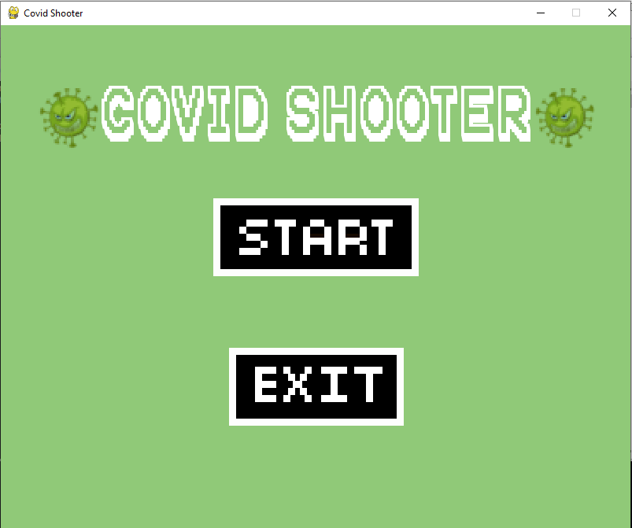
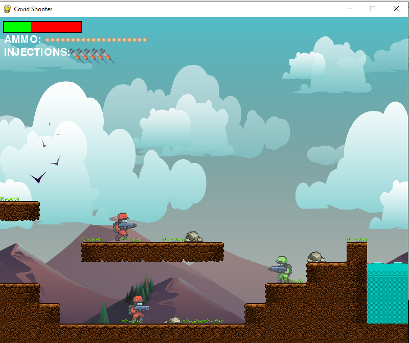

# Covid Shooter

Covid Shooter is an arcade game built using pygame. It is inspired by the legendary arcade game "Mario".

## Background

In this tough time of being locked inside our homes, building something new is a good way to learn new and trending technologies and showcase your skills. So, we decided to build this arcade game as our Python Project Assignment.

## Screenshots

## Game Play

Covid Shooter is a single player arcade game in which the player has to get past all the obstacles in her way and reach to the end without being hit by Covid-19 virus guns else her health will reduce. There will be collectibles in the game levels such as injections, Bullets and Masks which will help the player to be alive. If a player dies, he can restart the level.

The controls for each player are as follows:

        Left:              Left Arrow
        Right:             Right Arrow
        Jump:              Up Arrow
        Shoot:             SPACE
        Throw Injection:   Q

## Usage

Run `python main.py` to start the game.

## License

Covid Shooter is licensed under MIT License. Check out [License](https://github.com/TheCodinggDude/Covid-Shooter/blob/main/LICENSE) to know more.

## Acknowledgements

Some of the sprites, music/sfx, icons belong to their respective owners. We sincerely thank them for letting us use them.
